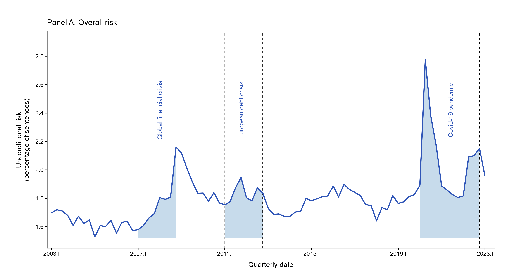
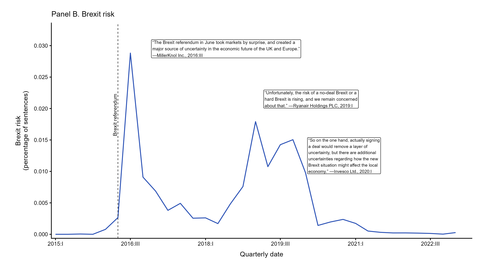
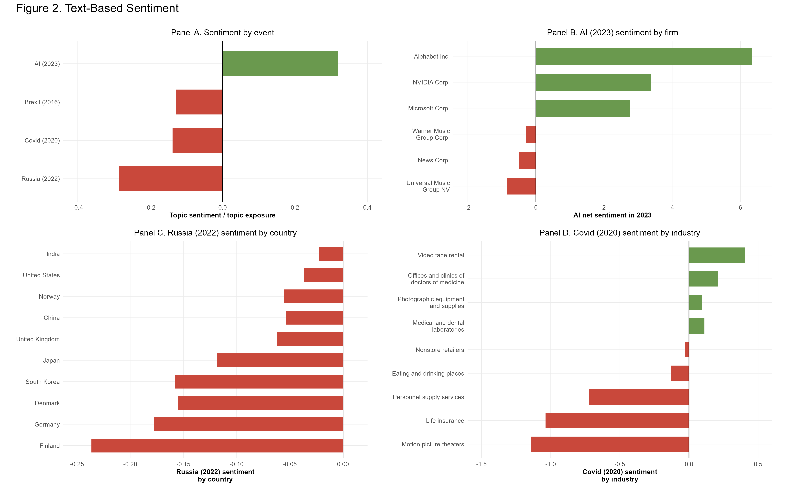

## Table of Content {.smaller}

This presentation is organised into the following sections:

:::: columns
::: {.column width="50%"}
1.  [Introduction](#introduction)\

2.  [Significance of Using R](#significance-of-using-r)\

3.  [R Script and Replication Workflow](#r-script-and-replication-workflow)\

4.  [Clean Start: Environment Setup](#clean-start-environment-setup)

5.  [Required R Packages](#required-r-packages)

6.  [Replication of Figure 1 and Figure 2](#replication-of-figure-1-and-figure-2)

7.  [Hurdles Encountered](#hurdles-encountered)
:::
::::

## Abstract {.smaller}

This project replicates Figure 1 and Figure 2 from Hassan et al.'s paper *Text as Data in Economic Analysis*. The original study demonstrates how corporate earnings-call transcripts can be used as textual data to measure economic risk, exposure, and sentiment.

Using R, this project reproduces selected visualisations that show overall risk, Brexit-related risk, and topic-specific sentiment across major economic events such as Covid-19, Russia's invasion of Ukraine, Brexit, and artificial intelligence. The replication process highlights how unstructured text can be converted into structured quantitative measures and presented through clear graphical analysis.

------------------------------------------------------------------------

## Introduction {#introduction .smaller}

This project focuses on the replication of selected figures from the research paper *Text as Data in Economic Analysis* by Hassan et al. (2025).

The paper shows how corporate earnings-call transcripts can be transformed into measurable economic indicators such as:

- Risk
- Exposure
- Sentiment

By analyzing unstructured corporate text, the authors capture firms' perceptions of major economic shocks, including financial crises, Brexit, Covid-19, geopolitical events, inflation, and artificial intelligence.

------------------------------------------------------------------------

## Significance of using R {#significance-of-using-r .smaller}

R is highly useful for this project because it provides powerful tools for:

- Data cleaning
- Statistical analysis
- Text-related data processing
- Data aggregation
- Publication-quality visualisation

Important packages used in the script include `tidyverse`, `ggplot2`, `data.table`, `janitor`, `lubridate`, `patchwork`, `scales`, and `stringr`.

------------------------------------------------------------------------

## R and reproducibility {.smaller}

R supports transparent and reproducible research workflows.

In this project, R made it possible to document each step clearly:

- Importing CSV files
- Cleaning and standardizing variables
- Calculating risk and sentiment measures
- Creating panel figures
- Saving high-resolution outputs

This is important in academic research because results should be accurate, consistent, and repeatable.

------------------------------------------------------------------------

## Replication Script for Figure 1 and Figure 2: Text-Based Risk and Sentiment Analysis {.smaller}

The script follows a structured workflow:

1.  Cleans the R environment
2.  Loads required packages
3.  Sets project, data, and output folders
4.  Imports topic-level CSV files
5.  Cleans and standardizes data
6.  Create Panels for Figure 1 and Figure 2
7.  Saves the final figures as PNG files

------------------------------------------------------------------------

## Running the R script {.smaller}

#### START FRESH: CLEAN MEMORY, ENVIRONMENT, PLOTS, AND PACKAGES

```{r}
# ============================================================
# 0. START FRESH: CLEAN MEMORY, ENVIRONMENT, PLOTS, AND PACKAGES
# ============================================================

# Clear all objects from the Global Environment.
rm(list = ls(envir = .GlobalEnv), envir = .GlobalEnv)

# Clear the RStudio console.
cat("\014")

# Close all open plots.
graphics.off()

# Free unused memory.
gc()
```

This setup section was included to make sure the R project starts in a clean, reproducible, and stable environment. First, I cleared all objects from the Global Environment so that no old variables or datasets from previous work could affect the results. I also cleared the RStudio console and closed all open plots to keep the workspace organized and easier to follow during execution.

```{r}
# Detach extra packages from the search path.
# Do NOT use unload = TRUE because it can break compiled packages like data.table.
base_packages <- c(
  "package:stats",
  "package:graphics",
  "package:grDevices",
  "package:utils",
  "package:datasets",
  "package:methods",
  "package:base"
)

attached_packages <- grep("^package:", search(), value = TRUE)
packages_to_detach <- setdiff(attached_packages, base_packages)

if (length(packages_to_detach) > 0) {
  for (pkg in rev(packages_to_detach)) {
    try(detach(pkg, character.only = TRUE, unload = FALSE, force = TRUE), silent = TRUE)
  }
}

# Remove cleanup helper objects.
rm(base_packages, attached_packages, packages_to_detach)

# Free memory again.
gc()

# Set seed for reproducibility.
set.seed(123)
```

I used `gc()` to free unused memory, which is helpful when working with larger datasets or multiple plots. I also detached extra packages from the search path while keeping the base R packages loaded. This was done to reduce package conflicts and avoid unexpected behavior caused by functions with the same name from different packages. I avoided using `unload = TRUE` because some compiled packages, such as `data.table`, can break or behave unpredictably when fully unloaded during a session. After cleaning the workspace, I removed the helper objects used during the cleanup process and ran garbage collection again to free memory. I then set a seed using `set.seed(123)` so that any random operations in the project would produce the same results each time the code is run. This improves reproducibility.

------------------------------------------------------------------------

#### INSTALL AND LOAD REQUIRED PACKAGES & SET PROJECT FOLDERS

```{r}
# ============================================================
# 1. INSTALL AND LOAD REQUIRED PACKAGES
# ============================================================

# List all packages needed for this project.
# tidyverse: data cleaning, transformation, and ggplot2 graphics
# data.table: fast CSV import with fread()
# janitor: clean column names
# lubridate: work with dates, years, and quarters
# patchwork: combine multiple ggplot figures
# scales: improve axis formatting
# stringr: detect and clean text patterns
packages <- c(
  "tidyverse",
  "data.table",
  "janitor",
  "lubridate",
  "patchwork",
  "scales",
  "stringr"
)

# Install a package only if it is missing from the computer.
install_if_missing <- function(pkg) {
  if (!requireNamespace(pkg, quietly = TRUE)) {
    install.packages(pkg)
  }
}

# Check every package in the list and install missing ones.
invisible(lapply(packages, install_if_missing))

# Load all required packages.
# suppressPackageStartupMessages() keeps the output clean for presentation.
suppressPackageStartupMessages({
  library(tidyverse)
  library(data.table)
  library(janitor)
  library(lubridate)
  library(patchwork)
  library(scales)
  library(stringr)
})
# ============================================================
# 2. SET PROJECT FOLDERS
# ============================================================

# Set the main project folder.
# Change this path if your data are stored somewhere else.
project_dir <- "B:/Data_science_BA/Raw_Data"

# If the folder above is not found, use the current working directory instead.
# This makes the script easier to run from a Quarto or R Markdown project folder.
if (!dir.exists(project_dir)) {
  warning(
    "The folder 'B:/Data_science_BA/Raw_Data' was not found. ",
    "Using the current working directory instead: ", getwd()
  )
  project_dir <- getwd()
}

# Set the working directory to the project folder.
setwd(project_dir)

# Define the folder containing the NL Analytics CSV files.
nl_dir <- file.path(project_dir, "nl_analytics")

# Define the folder where final figures will be saved.
output_dir <- file.path(project_dir, "Presentation_Fig")

# Create the output folder if it does not already exist.
dir.create(output_dir, showWarnings = FALSE, recursive = TRUE)

# Stop the script early if the expected data folder is missing.
if (!dir.exists(nl_dir)) {
  stop("Data folder not found: ", nl_dir)
}

# Print the folders being used so the audience can see the data source and output location.
message("Project folder: ", project_dir)
message("Data folder: ", nl_dir)
message("Output folder: ", output_dir)
```

Finally, I created a list of required packages for the project and wrote a small function to install any missing packages automatically. This makes the code easier to run on a new computer without manually checking package availability. The selected packages were necessary for the project: `tidyverse` was used for data cleaning, transformation, and visualization; `data.table` for fast CSV import; `janitor` for cleaning column names; `lubridate` for handling dates; `patchwork` for combining plots; `scales` for better axis formatting; and `stringr` for working with text patterns. I used `suppressPackageStartupMessages()` when loading the packages to keep the output clean and professional for presentation. In this section, I set the main project folders so that R knows where to find the raw data and where to save the final outputs. I also added checks to make the script more reliable: if the main folder is not found, the code uses the current working directory, and if the required `nl_analytics` data folder is missing, the script stops with a clear error message. This helps avoid running the analysis with missing or incorrect data paths.

------------------------------------------------------------------------

#### DEFINE HELPER FUNCTIONS

```{r}
# ============================================================
# 3. DEFINE HELPER FUNCTIONS
# ============================================================

# This function reads one CSV file from the data folder.
# It first looks for the exact file name, then allows uploaded duplicate names
# such as covid(2).csv by searching for files that begin with the same stem.
read_topic_csv <- function(file_name, required = TRUE) {
  exact_paths <- c(
    file.path(nl_dir, file_name),
    file.path(project_dir, file_name),
    file.path(getwd(), file_name)
  )
  
  exact_paths <- exact_paths[file.exists(exact_paths)]
  
  if (length(exact_paths) > 0) {
    file_path <- exact_paths[1]
  } else {
    file_stem <- tools::file_path_sans_ext(file_name)
    loose_paths <- c(
      Sys.glob(file.path(nl_dir, paste0(file_stem, "*.csv"))),
      Sys.glob(file.path(project_dir, paste0(file_stem, "*.csv"))),
      Sys.glob(file.path(getwd(), paste0(file_stem, "*.csv")))
    )
    loose_paths <- unique(loose_paths[file.exists(loose_paths)])
    
    if (length(loose_paths) == 0) {
      if (required) {
        stop("File not found: ", file_name, " in ", nl_dir, " or ", project_dir)
      } else {
        warning("Optional file not found: ", file_name)
        return(NULL)
      }
    }
    file_path <- loose_paths[1]
  }
  
  message("Reading: ", file_path)
  data <- data.table::fread(file_path)
  data <- janitor::clean_names(data)
  
  return(data)
}


# This function standardizes each topic data file.
# It creates common columns such as topic, year, quarter, firm, country, and industry.
clean_topic_file <- function(df, topic_name) {
  
  df <- janitor::clean_names(df)
  
  if ("earningscall_id" %in% names(df)) {
    df$earningscall_id <- as.character(df$earningscall_id)
  }
  
  out <- df %>%
    mutate(
      # Add topic name so each row can be identified after combining data.
      topic = topic_name,
      
      # Convert quarterly date into Date format and extract year/quarter.
      date_q = as.Date(date_q),
      year = lubridate::year(date_q),
      quarter = lubridate::quarter(date_q),
      qtr = paste0(year, " Q", quarter),
      qtr_date = date_q,
      
      # Convert main text measures into numeric form.
      topic_exposure = as.numeric(exposure),
      topic_sentiment = as.numeric(sentiment),
      topic_risk = as.numeric(risk),
      
      # Create readable firm and country variables.
      firm = as.character(company_name),
      country = as.character(headquarterscountry),
      
      # Convert possible industry columns into text.
      trbc_text = as.character(trbc),
      business_sector_text = as.character(business_sector),
      economic_sector_text = as.character(economic_sector),
      
      # Use the best available industry label.
      industry = dplyr::case_when(
        !is.na(business_sector_text) & business_sector_text != "" ~ business_sector_text,
        !is.na(economic_sector_text) & economic_sector_text != "" ~ economic_sector_text,
        !is.na(trbc_text) & trbc_text != "" ~ trbc_text,
        TRUE ~ NA_character_
      )
    ) %>%
    select(
      topic, firm, country, industry,
      date_q, qtr_date, year, quarter, qtr,
      topic_exposure, topic_sentiment, topic_risk,
      any_of(c("positive", "negative", "nr_of_sentences")),
      everything()
    )
  
  return(out)
}


# This function formats dates as year plus Roman-numeral quarter.
# Example: 2020 Q1 becomes 2020:I.
quarter_label <- function(x) {
  q <- lubridate::quarter(x)
  roman_q <- c("I", "II", "III", "IV")[q]
  paste0(lubridate::year(x), ":", roman_q)
}

```

I defined helper functions to avoid repeating the same code many times and to make the data preparation process more structured. Since the project uses several topic CSV files from the `nl_analytics` folder, I created functions that can read, clean, and standardize each file in the same way.

The first function, `read_topic_csv()`, reads one CSV file from the project folder. It creates the full file path, checks whether the file exists, and stops with a clear error message if the file is missing. I used `data.table::fread()` because it is faster than base R functions when reading larger CSV files. After importing the file, I used `janitor::clean_names()` to convert column names into a consistent format, such as changing `"Company Name"` into `company_name`. This makes the columns easier to use later in the code.

The second function, `clean_topic_file()`, standardizes each topic dataset. This was necessary because all topic files need to have the same important columns before they can be combined. The function adds a `topic` column so that each row can still be identified after merging datasets. It also converts the quarterly date into a proper date format and extracts the year, quarter, and quarter label. In addition, it converts exposure, sentiment, and risk values into numeric variables so they can be used for calculations and plots.

I also created readable variables for firm, country, and industry. Since industry information may appear in different columns, I used `case_when()` to choose the best available industry label from business sector, economic sector, or TRBC. This makes the dataset more complete and consistent.

The final helper function, `quarter_label()`, formats dates into a clearer quarter label using Roman numerals, such as changing 2020 Q1 into `2020:I`. This improves the readability of time labels in tables and visualizations.

Overall, this section was written to make the data cleaning process reproducible, reduce repeated code, prevent errors, and prepare all topic files in a consistent structure for later analysis.

------------------------------------------------------------------------

#### IMPORT ALL CSV FILES & CLEAN AND STANDARDIZE TOPIC DATA

```{r}
# ============================================================
# 4. IMPORT ALL CSV FILES NEEDED FOR FIGURE 1 AND FIGURE 2
# ============================================================

# DATA USED FOR FIGURE 1 AND FIGURE 2
#
# Figure 1, Panel A: Overall risk
#   Data files: ml_ai_unconditional.csv + ml_ai.csv
#   Extraction: ml_ai_unconditional.csv gives unconditional risk sentence counts
#               and nr_of_sentences. ml_ai.csv is used only as a date lookup
#               through earningscall_id because the unconditional file does not
#               contain date_q.
#   Calculation: quarterly mean of
#                100 * unconditional_risk_sentences_count / nr_of_sentences.
#
# Figure 1, Panel B: Brexit risk
#   Data file: brexit.csv
#   Extraction: date_q and risk from the Brexit topic file.
#   Calculation: quarterly mean of topic risk, converted to percentage scale.
#
# Figure 2, Panel A: Sentiment by event
#   Data files: ml_ai.csv, russia.csv, covid.csv, brexit.csv
#   Extraction: event-year earnings calls with topic exposure > 0.
#   Calculation: original-study style average across earnings calls.
#                For each affected call, calculate TopicSentiment / TopicExposure,
#                then take the unweighted average across calls. Panel A is sorted
#                in descending order by this calculated value so the highest
#                sentiment appears at the top, matching the original Figure 2 layout.
#
# Figure 2, Panel B: AI sentiment by firm
#   Data file: ml_ai.csv
#   Extraction: selected firms in 2023.
#   Calculation: mean(sentiment) * 100 by firm.
#
# Figure 2, Panel C: Russia sentiment by country
#   Data file: russia.csv
#   Extraction: selected headquarters countries in 2022.
#   Calculation: mean(sentiment) * 100 by country.
#
# Figure 2, Panel D: Covid sentiment by industry
#   Data files: covid.csv + ml_ai_gvkeys.csv
#   Extraction: Covid calls in 2020, U.S.-headquartered firms only.
#               ml_ai_gvkeys.csv supplies sic_compustat through earningscall_id.
#   Calculation: convert sic_compustat to 3-digit SIC sector and calculate
#                mean(sentiment) * 100 for the original SIC3 industry groups.

# Import the topic-level data files.
# These files are used to calculate exposure, risk, and sentiment measures.
brexit       <- read_topic_csv("brexit.csv")
covid        <- read_topic_csv("covid.csv")
inflation    <- read_topic_csv("inflation.csv")
ml_ai        <- read_topic_csv("ml_ai.csv")
ml_ai_uncond <- read_topic_csv("ml_ai_unconditional.csv", required = FALSE)
ml_ai_gvkeys <- read_topic_csv("ml_ai_gvkeys.csv")
russia       <- read_topic_csv("russia.csv")
russian_war  <- read_topic_csv("russian_war.csv", required = FALSE)
supplychain  <- read_topic_csv("supplychain.csv", required = FALSE)
trade        <- read_topic_csv("trade.csv")

# Show a short message to confirm successful import.
message("All required CSV files were imported successfully.")


# ============================================================
# 5. CLEAN AND STANDARDIZE TOPIC DATA
# ============================================================

# Apply the same cleaning function to each topic file.
ai_clean        <- clean_topic_file(ml_ai, "AI")
brexit_clean    <- clean_topic_file(brexit, "Brexit")
covid_clean     <- clean_topic_file(covid, "Covid")
russia_clean    <- clean_topic_file(russia, "Russia")
inflation_clean <- clean_topic_file(inflation, "Inflation")
trade_clean     <- clean_topic_file(trade, "Trade")

if (!is.null(russian_war)) {
  russian_war_clean <- clean_topic_file(russian_war, "Russia War")
}

if (!is.null(supplychain)) {
  supplychain_clean <- clean_topic_file(supplychain, "Supply chain")
}

gvkeys_sic <- ml_ai_gvkeys %>%
  janitor::clean_names() %>%
  dplyr::transmute(
    earningscall_id = as.character(earningscall_id),
    sic_compustat = as.integer(sic_compustat)
  ) %>%
  dplyr::filter(!is.na(earningscall_id), !is.na(sic_compustat)) %>%
  dplyr::distinct(earningscall_id, .keep_all = TRUE)

# Check that dates were converted correctly.
message("Missing AI dates: ", sum(is.na(ai_clean$qtr_date)))
message("Missing Brexit dates: ", sum(is.na(brexit_clean$qtr_date)))

```

After setting the folders, I imported all CSV files needed for Figure 1 and Figure 2. These files contain the topic-level measures for AI, Brexit, covid, inflation, Russia, supply chain, and trade. Then, I applied the same cleaning function to each file so that all data sets have consistent column names, date variables, topic labels, and numerical measures. This makes the data sets ready to be combined and used for the final analysis and visualizations.

------------------------------------------------------------------------

#### FIGURE 1: TEXT-BASED RISK

```{r}
# ============================================================
# FIGURE 1: TEXT-BASED RISK
# Panel A: Overall risk
# Panel B: Brexit risk
# ============================================================

# ============================================================
# 6. PREPARE FIGURE 1, PANEL A: OVERALL RISK
# ============================================================

# The unconditional risk file does not contain date_q.
# Therefore, we take date_q from the AI file using earningscall_id as the matching key.
uncond_clean <- ml_ai_uncond %>%
  janitor::clean_names() %>%
  mutate(
    earningscall_id = as.character(earningscall_id),
    nr_of_sentences = as.numeric(nr_of_sentences),
    unconditional_risk_sentences_count = as.numeric(unconditional_risk_sentences_count),
    
    # Convert risk sentence count into a percentage of all sentences in the call.
    overall_risk_pct = 100 * unconditional_risk_sentences_count / nr_of_sentences
  )

# Create a lookup table with earnings call ID and quarterly date.
date_lookup <- ml_ai %>%
  janitor::clean_names() %>%
  mutate(
    earningscall_id = as.character(earningscall_id),
    date_q = as.Date(date_q),
    year = lubridate::year(date_q),
    quarter = lubridate::quarter(date_q),
    qtr_date = date_q
  ) %>%
  select(earningscall_id, qtr_date, year, quarter) %>%
  distinct()

# Join the unconditional risk data with the date lookup table.
overall_risk_call_level <- uncond_clean %>%
  left_join(date_lookup, by = "earningscall_id") %>%
  filter(
    !is.na(qtr_date),
    year >= 2003,
    year <= 2023,
    !is.na(overall_risk_pct)
  )

# Aggregate from earnings-call level to quarterly average risk.
fig1a <- overall_risk_call_level %>%
  group_by(qtr_date) %>%
  summarise(
    overall_risk = mean(overall_risk_pct, na.rm = TRUE),
    .groups = "drop"
  ) %>%
  arrange(qtr_date)

# Print a preview so the audience can see the structure of the prepared data.
message("Preview of Figure 1 Panel A data:")
print(head(fig1a))


# ============================================================
# 7. PREPARE FIGURE 1, PANEL B: BREXIT RISK
# ============================================================

# Check whether Brexit risk is stored as a fraction or already as a percent.
risk_scale_check <- median(abs(brexit_clean$topic_risk), na.rm = TRUE)

# Stop if the risk column is empty or unreadable.
if (is.na(risk_scale_check)) {
  stop("Brexit topic_risk is all NA. Check the risk column in brexit.csv.")
}

# Convert Brexit risk to percentage scale if necessary.
if (risk_scale_check > 1) {
  brexit_clean <- brexit_clean %>%
    mutate(brexit_risk_pct = topic_risk)
} else {
  brexit_clean <- brexit_clean %>%
    mutate(brexit_risk_pct = topic_risk * 100)
}

# Aggregate Brexit risk by quarter.
fig1b <- brexit_clean %>%
  filter(
    !is.na(qtr_date),
    year >= 2015,
    year <= 2023,
    !is.na(brexit_risk_pct)
  ) %>%
  group_by(qtr_date) %>%
  summarise(
    brexit_risk = mean(brexit_risk_pct, na.rm = TRUE),
    .groups = "drop"
  ) %>%
  arrange(qtr_date)

# Print a preview of the Brexit risk data.
message("Preview of Figure 1 Panel B data:")
print(head(fig1b))


# ============================================================
# 8. SET COLORS AND THEME FOR FIGURE 1
# ============================================================

# Blue line color for Figure 1.
line_col <- "#2F55B7"

# Light blue shaded areas to highlight crisis periods.
shade_col <- "#BDD5E8"

# Create a common theme for both panels of Figure 1.
fig1_theme <- theme_classic(base_size = 12) +
  theme(
    plot.title = element_text(size = 12, face = "plain", hjust = 0, margin = margin(b = 8)),
    axis.title.x = element_text(size = 11, margin = margin(t = 8)),
    axis.title.y = element_text(size = 11, margin = margin(r = 8)),
    axis.text.x = element_text(size = 9),
    axis.text.y = element_text(size = 9),
    plot.margin = margin(t = 18, r = 30, b = 18, l = 25)
  )

```

------------------------------------------------------------------------

##### Panel A: Overall Risk

```{r}
# ============================================================
# 9. CREATE FIGURE 1, PANEL A: OVERALL RISK LINE CHART
# ============================================================

# Define the lower limit used for the shaded areas.
# This helps us shade only from the bottom of the panel up to the line,
# instead of shading the entire dashed-rectangle region.
risk_ymin <- 1.52

# Define the crisis periods so they are easy to edit and explain.
# The start dates are adjusted to match the original figure:
# - Global financial crisis starts at 2007:I
# - European debt crisis starts at 2011:I
# - Covid-19 pandemic starts at 2020:I
gfc_start   <- as.Date("2007-01-01")
gfc_end     <- as.Date("2008-10-01")

edc_start   <- as.Date("2011-01-01")
edc_end     <- as.Date("2012-10-01")

covid_start <- as.Date("2020-01-01")
covid_end   <- as.Date("2022-10-01")

p1a <- ggplot(fig1a, aes(x = qtr_date, y = overall_risk)) +
  
  # ------------------------------------------------------------
# Shade only the area under the line for the Global Financial Crisis.
# This matches the original figure more closely than shading the full band.
# ------------------------------------------------------------
geom_ribbon(
  data = fig1a %>% filter(qtr_date >= gfc_start & qtr_date <= gfc_end),
  aes(x = qtr_date, ymin = risk_ymin, ymax = overall_risk),
  inherit.aes = FALSE,
  fill = shade_col,
  alpha = 0.85
) +
  
  # ------------------------------------------------------------
# Shade only the area under the line for the European debt crisis.
# ------------------------------------------------------------
geom_ribbon(
  data = fig1a %>% filter(qtr_date >= edc_start & qtr_date <= edc_end),
  aes(x = qtr_date, ymin = risk_ymin, ymax = overall_risk),
  inherit.aes = FALSE,
  fill = shade_col,
  alpha = 0.85
) +
  
  # ------------------------------------------------------------
# Shade only the area under the line for the Covid-19 pandemic.
# ------------------------------------------------------------
geom_ribbon(
  data = fig1a %>% filter(qtr_date >= covid_start & qtr_date <= covid_end),
  aes(x = qtr_date, ymin = risk_ymin, ymax = overall_risk),
  inherit.aes = FALSE,
  fill = shade_col,
  alpha = 0.85
) +
  
  # ------------------------------------------------------------
# Add dashed vertical lines to mark the start and end of each crisis period.
# These dates are adjusted to visually match the original published figure.
# ------------------------------------------------------------
geom_vline(xintercept = gfc_start,   linetype = "dashed", linewidth = 0.4) +
  geom_vline(xintercept = gfc_end,     linetype = "dashed", linewidth = 0.4) +
  geom_vline(xintercept = edc_start,   linetype = "dashed", linewidth = 0.4) +
  geom_vline(xintercept = edc_end,     linetype = "dashed", linewidth = 0.4) +
  geom_vline(xintercept = covid_start, linetype = "dashed", linewidth = 0.4) +
  geom_vline(xintercept = covid_end,   linetype = "dashed", linewidth = 0.4) +
  
  # ------------------------------------------------------------
# Draw the overall risk line on top of the shaded ribbons.
# ------------------------------------------------------------
geom_line(color = line_col, linewidth = 0.85) +
  
  # ------------------------------------------------------------
# Add vertical labels for the three crisis episodes.
# These are positioned approximately in the middle of each shaded window.
# ------------------------------------------------------------
annotate(
  "text",
  x = as.Date("2008-01-01"),
  y = 2.42,
  label = "Global financial crisis",
  angle = 90,
  size = 3.4,
  color = line_col
) +
  annotate(
    "text",
    x = as.Date("2011-10-01"),
    y = 2.42,
    label = "European debt crisis",
    angle = 90,
    size = 3.4,
    color = line_col
  ) +
  annotate(
    "text",
    x = as.Date("2021-06-01"),
    y = 2.42,
    label = "Covid-19 pandemic",
    angle = 90,
    size = 3.4,
    color = line_col
  ) +
  
  # ------------------------------------------------------------
# Format the x-axis with quarterly labels shown in the paper.
# ------------------------------------------------------------
scale_x_date(
  limits = as.Date(c("2003-01-01", "2023-03-31")),
  breaks = as.Date(c(
    "2003-01-01",
    "2007-01-01",
    "2011-01-01",
    "2015-01-01",
    "2019-01-01",
    "2023-01-01"
  )),
  labels = quarter_label,
  expand = expansion(mult = c(0.01, 0.01))
) +
  
  # ------------------------------------------------------------
# Set the y-axis limits and breaks to resemble the original panel.
# ------------------------------------------------------------
scale_y_continuous(
  limits = c(1.45, 2.90),
  breaks = seq(1.6, 2.8, by = 0.2),
  expand = expansion(mult = c(0.00, 0.05))
) +
  
  # ------------------------------------------------------------
# Add panel title and axis labels.
# ------------------------------------------------------------
labs(
  title = "Panel A. Overall risk",
  x = "Quarterly date",
  y = "Unconditional risk\n(percentage of sentences)"
) +
  
  # Keep the clean visual style already used in your figure.
  coord_cartesian(clip = "off") +
  fig1_theme +
  theme(
    plot.margin = margin(t = 30, r = 30, b = 18, l = 25)
  )
# Save Panel A: Overall risk
ggsave(
  filename = file.path(output_dir, "figure1_panel_a_overall_risk.png"),
  plot = p1a,
  width = 11,
  height = 6,
  dpi = 300,
  bg = "white"
)

```

------------------------------------------------------------------------

##### Figure 1, Panel A: Overall Risk

{.r-stretch fig-align="center"}

This panel shows the average overall risk discussed in corporate earnings calls over time. The y-axis measures the percentage of sentences that contain risk or uncertainty-related terms. The line increases during major crisis periods, including the global financial crisis, the European debt crisis, and the Covid-19 pandemic. This shows that firms discuss risk more frequently when economic uncertainty rises.

------------------------------------------------------------------------

##### Panel B: Brexit risk

```{r}
# ============================================================
# 10. CREATE FIGURE 1, PANEL B: BREXIT RISK LINE CHART
# ============================================================

# Important note about the Brexit referendum line:
# The data are plotted by quarter. The 2016:III observation starts on 2016-07-01.
# If we draw the vertical line on 2016-06-23, it appears almost on top of the
# 2016:III spike. To visually match the original figure, we place the dashed
# referendum marker slightly earlier, at the beginning of 2016:II.
brexit_ref_line <- as.Date("2016-04-01")

p1b <- ggplot(fig1b, aes(x = qtr_date, y = brexit_risk)) +
  
  # Plot Brexit risk over time.
  geom_line(color = line_col, linewidth = 0.70) +
  
  # Add the dashed vertical marker for the Brexit referendum.
  # This is placed just before the sharp 2016:III spike, matching the paper layout.
  geom_vline(
    xintercept = brexit_ref_line,
    linetype = "dashed",
    linewidth = 0.35
  ) +
  
  # Add the vertical label beside the dashed referendum line.
  annotate(
    "text",
    x = as.Date("2016-03-10"),
    y = 0.019,
    label = "Brexit referendum",
    angle = 90,
    size = 3.0,
    hjust = 0.5,
    vjust = 0.5
  ) +
  
  # Add explanatory quote 1 from the earnings-call discussion.
  annotate(
    "label",
    x = as.Date("2016-12-01"),
    y = 0.0295,
    label = "“The Brexit referendum in June took markets by surprise, and created a\nmajor source of uncertainty in the economic future of the UK and Europe.”\n—MillerKnol Inc., 2016:III",
    size = 2.55,
    hjust = 0,
    label.size = 0.25,
    label.padding = unit(0.18, "lines"),
    fill = "white"
  ) +
  
  # Add explanatory quote 2 from the earnings-call discussion.
  annotate(
    "label",
    x = as.Date("2019-03-01"),
    y = 0.0215,
    label = "“Unfortunately, the risk of a no-deal Brexit or a\nhard Brexit is rising, and we remain concerned\nabout that.” —Ryanair Holdings PLC, 2019:I",
    size = 2.55,
    hjust = 0,
    label.size = 0.25,
    label.padding = unit(0.18, "lines"),
    fill = "white"
  ) +
  
  # Add explanatory quote 3 from the earnings-call discussion.
  annotate(
    "label",
    x = as.Date("2020-01-15"),
    y = 0.0125,
    label = "“So on the one hand, actually signing\na deal would remove a layer of\nuncertainty, but there are additional\nuncertainties regarding how the new\nBrexit situation might affect the local\neconomy.” —Invesco Ltd., 2020:I",
    size = 2.45,
    hjust = 0,
    label.size = 0.25,
    label.padding = unit(0.18, "lines"),
    fill = "white"
  ) +
  
  # Format the x-axis using the same quarterly labels as the paper.
  scale_x_date(
    limits = as.Date(c("2015-01-01", "2023-03-31")),
    breaks = as.Date(c(
      "2015-01-01",
      "2016-07-01",
      "2018-01-01",
      "2019-07-01",
      "2021-01-01",
      "2022-07-01"
    )),
    labels = quarter_label,
    expand = expansion(mult = c(0.01, 0.01))
  ) +
  
  # Format the y-axis to keep the same percentage scale.
  scale_y_continuous(
    limits = c(0, 0.032),
    breaks = seq(0, 0.03, by = 0.005),
    expand = expansion(mult = c(0.02, 0.05))
  ) +
  
  # Add panel title and axis labels.
  labs(
    title = "Panel B. Brexit risk",
    x = "Quarterly date",
    y = "Brexit risk\n(percentage of sentences)"
  ) +
  
  # Keep labels inside the plotting area and use the same clean theme.
  coord_cartesian(clip = "off") +
  fig1_theme +
  theme(
    plot.title = element_text(size = 12, face = "plain", hjust = 0, margin = margin(b = 8)),
    plot.margin = margin(t = 18, r = 34, b = 18, l = 25)
  )
# Save Panel B: Brexit risk
ggsave(
  filename = file.path(output_dir, "figure1_panel_b_brexit_risk.png"),
  plot = p1b,
  width = 11,
  height = 6,
  dpi = 300,
  bg = "white"
)
```

------------------------------------------------------------------------

##### Figure 1, Panel B: Brexit Risk

{.r-stretch fig-align="center"}

This panel focuses specifically on Brexit-related risk. It measures the percentage of earnings-call sentences that mention both Brexit and risk-related language. The sharp increase after the 2016 Brexit referendum shows that firms became more concerned about the economic and policy uncertainty caused by the United Kingdom’s decision to leave the European Union. Later increases reflect continued uncertainty around the Brexit agreement and the possibility of a no-deal Brexit.

------------------------------------------------------------------------

#### FIGURE 2: TEXT-BASED SENTIMENT

```{r}
# ============================================================
# FIGURE 2: TEXT-BASED SENTIMENT
# Panel A: Sentiment by event
# Panel B: AI sentiment by firm
# Panel C: Russia sentiment by country
# Panel D: Covid sentiment by industry
# ============================================================

# ============================================================
# 12. SET COLORS AND THEME FOR FIGURE 2
# ============================================================

# Green is used for positive sentiment and red is used for negative sentiment.
pos_col <- "#6A994E"
neg_col <- "#C9483B"

# Common theme for the four panels of Figure 2.
panel_theme <- theme_minimal(base_size = 11) +
  theme(
    plot.title = element_text(size = 12, face = "plain", hjust = 0.5),
    axis.title.x = element_text(size = 10, face = "bold"),
    axis.text.x = element_text(size = 9),
    axis.text.y = element_text(size = 9, hjust = 1),
    panel.grid.minor = element_blank(),
    panel.grid.major.y = element_line(linewidth = 0.3),
    panel.grid.major.x = element_line(linewidth = 0.25),
    plot.margin = margin(t = 8, r = 18, b = 8, l = 18)
  )
# ============================================================
# 13. CREATE FIGURE 2, PANEL A: SENTIMENT BY EVENT
# ============================================================

# IMPORTANT FIX FOR PANEL A
# This version recalculates Panel A using the original-study aggregation rule:
# take an unweighted average across earnings calls of the call-level
# topic-specific sentiment measure.
#
# The plotted call-level measure is:
#   TopicSentiment / TopicExposure
# for calls in the event year where TopicExposure > 0.
#
# This is intentionally NOT sentence-weighted, exposure-weighted, or calculated
# as aggregate total TopicSentiment divided by aggregate total TopicExposure.
# Each earnings call receives one equal weight, matching the study description
# that topic-specific sentiment is averaged across earnings calls.
#
# Data used:
#   AI (2023):     ml_ai.csv
#   Brexit (2016): brexit.csv
#   Covid (2020):  covid.csv
#   Russia (2022): russia.csv
#
# Note: russia.csv is used here, not russian_war.csv, because the original
# Figure 2 event label is Russia (2022) and the panel is based on the Russia
# topic file. russian_war.csv is a narrower war-topic file and makes the Russia
# bar too negative for this panel.

make_panel_a_row <- function(data, event_name, event_year) {
  temp <- data %>%
    as.data.frame() %>%
    dplyr::filter(
      year == event_year,
      !is.na(topic_sentiment),
      !is.na(topic_exposure),
      topic_exposure > 0,
      is.finite(topic_sentiment),
      is.finite(topic_exposure)
    )
  
  if (nrow(temp) == 0) {
    stop("No usable data found for ", event_name, ". Check the file and year filter.")
  }
  
  # Make sure the aggregation unit is the earnings call. Most topic files are
  # already one row per earnings call, but this guard prevents accidental double
  # counting if duplicate rows appear after importing or joining.
  if ("earningscall_id" %in% names(temp)) {
    temp_call <- temp %>%
      dplyr::group_by(earningscall_id) %>%
      dplyr::summarise(
        topic_sentiment_call = mean(topic_sentiment, na.rm = TRUE),
        topic_exposure_call = mean(topic_exposure, na.rm = TRUE),
        .groups = "drop"
      )
  } else {
    temp_call <- temp %>%
      dplyr::mutate(
        earningscall_id = dplyr::row_number(),
        topic_sentiment_call = topic_sentiment,
        topic_exposure_call = topic_exposure
      ) %>%
      dplyr::select(earningscall_id, topic_sentiment_call, topic_exposure_call)
  }
  
  temp_call <- temp_call %>%
    dplyr::filter(
      !is.na(topic_sentiment_call),
      !is.na(topic_exposure_call),
      is.finite(topic_sentiment_call),
      is.finite(topic_exposure_call),
      topic_exposure_call > 0
    ) %>%
    dplyr::mutate(
      sentiment_over_exposure_call = topic_sentiment_call / topic_exposure_call
    ) %>%
    dplyr::filter(
      !is.na(sentiment_over_exposure_call),
      is.finite(sentiment_over_exposure_call)
    )
  
  if (nrow(temp_call) == 0) {
    stop("No usable call-level observations found for ", event_name, ".")
  }
  
  tibble::tibble(
    event = event_name,
    event_year = event_year,
    data_file = dplyr::case_when(
      event_name == "AI (2023)" ~ "ml_ai.csv",
      event_name == "Brexit (2016)" ~ "brexit.csv",
      event_name == "Covid (2020)" ~ "covid.csv",
      event_name == "Russia (2022)" ~ "russia.csv",
      TRUE ~ NA_character_
    ),
    n_calls = dplyr::n_distinct(temp_call$earningscall_id),
    mean_topic_sentiment = mean(temp_call$topic_sentiment_call, na.rm = TRUE),
    mean_topic_exposure = mean(temp_call$topic_exposure_call, na.rm = TRUE),
    sentiment_over_exposure = mean(temp_call$sentiment_over_exposure_call, na.rm = TRUE)
  )
}

# Panel A should appear in descending order, matching the original figure.
# The order is computed from the recalculated call-level averages rather than
# hard-coded.
fig2a <- dplyr::bind_rows(
  make_panel_a_row(ai_clean,     "AI (2023)",     2023),
  make_panel_a_row(brexit_clean, "Brexit (2016)", 2016),
  make_panel_a_row(covid_clean,  "Covid (2020)",  2020),
  make_panel_a_row(russia_clean, "Russia (2022)", 2022)
) %>%
  dplyr::arrange(dplyr::desc(sentiment_over_exposure)) %>%
  dplyr::mutate(
    # ggplot draws discrete y-axis levels from bottom to top, so reverse the
    # descending order vector to display the largest value at the top.
    event = factor(event, levels = rev(as.character(event)))
  )

message("Figure 2 Panel A values calculated as the unweighted average across earnings calls of TopicSentiment / TopicExposure:")
print(fig2a)
readr::write_csv(fig2a, file.path(output_dir, "figure2_panelA_values_from_data.csv"))

p2a <- ggplot(fig2a, aes(x = sentiment_over_exposure, y = event, fill = sentiment_over_exposure > 0)) +
  geom_col(width = 0.65, show.legend = FALSE) +
  geom_vline(xintercept = 0, linewidth = 0.5) +
  scale_fill_manual(values = c("TRUE" = pos_col, "FALSE" = neg_col)) +
  scale_x_continuous(
    limits = c(-0.4, 0.4),
    breaks = c(-0.4, -0.2, 0, 0.2, 0.4)
  ) +
  labs(
    title = "Panel A. Sentiment by event",
    x = "Topic sentiment / topic exposure",
    y = NULL
  ) +
  panel_theme
# ============================================================
# 14. CREATE FIGURE 2, PANEL B: AI SENTIMENT BY FIRM
# ============================================================

# Keep only selected firms that appear in the original style of Panel B.
fig2b <- ai_clean %>%
  filter(year == 2023) %>%
  mutate(
    firm_label = case_when(
      str_detect(firm, regex("Alphabet", ignore_case = TRUE)) ~ "Alphabet Inc.",
      str_detect(firm, regex("NVIDIA", ignore_case = TRUE)) ~ "NVIDIA Corp.",
      str_detect(firm, regex("Microsoft", ignore_case = TRUE)) ~ "Microsoft Corp.",
      str_detect(firm, regex("Warner Music", ignore_case = TRUE)) ~ "Warner Music\nGroup Corp.",
      str_detect(firm, regex("^News Corp", ignore_case = TRUE)) ~ "News Corp.",
      str_detect(firm, regex("Universal Music", ignore_case = TRUE)) ~ "Universal Music\nGroup NV",
      TRUE ~ NA_character_
    )
  ) %>%
  filter(!is.na(firm_label)) %>%
  group_by(firm_label) %>%
  summarise(
    # Convert sentiment to percentage scale.
    ai_sentiment = mean(topic_sentiment, na.rm = TRUE) * 100,
    .groups = "drop"
  ) %>%
  mutate(
    firm_label = factor(
      firm_label,
      levels = rev(c(
        "Alphabet Inc.",
        "NVIDIA Corp.",
        "Microsoft Corp.",
        "Warner Music\nGroup Corp.",
        "News Corp.",
        "Universal Music\nGroup NV"
      ))
    )
  )

message("Figure 2 Panel B values calculated from ml_ai.csv:")
print(fig2b)
readr::write_csv(fig2b, file.path(output_dir, "figure2_panelB_values_from_data.csv"))

# Create horizontal bar chart for AI sentiment by firm.
p2b <- ggplot(fig2b, aes(x = ai_sentiment, y = firm_label, fill = ai_sentiment > 0)) +
  geom_col(width = 0.65, show.legend = FALSE) +
  geom_vline(xintercept = 0, linewidth = 0.5) +
  scale_fill_manual(values = c("TRUE" = pos_col, "FALSE" = neg_col)) +
  scale_x_continuous(
    limits = c(-2, 6.5),
    breaks = c(-2, 0, 2, 4, 6)
  ) +
  labs(
    title = "Panel B. AI (2023) sentiment by firm",
    x = "AI net sentiment in 2023",
    y = NULL
  ) +
  panel_theme
# ============================================================
# 15. CREATE FIGURE 2, PANEL C: RUSSIA SENTIMENT BY COUNTRY
# ============================================================

# Define the countries shown in Panel C.
country_order <- c(
  "India",
  "United States",
  "Norway",
  "China",
  "United Kingdom",
  "Japan",
  "South Korea",
  "Denmark",
  "Germany",
  "Finland"
)

# Calculate Russia-related sentiment for selected countries in 2022.
fig2c <- russia_clean %>%
  filter(year == 2022) %>%
  filter(country %in% country_order) %>%
  group_by(country) %>%
  summarise(
    # Convert sentiment to percentage scale.
    russia_sentiment = mean(topic_sentiment, na.rm = TRUE) * 100,
    .groups = "drop"
  ) %>%
  mutate(
    country = factor(country, levels = rev(country_order))
  )

message("Figure 2 Panel C values calculated from russia.csv:")
print(fig2c)
readr::write_csv(fig2c, file.path(output_dir, "figure2_panelC_values_from_data.csv"))

# Create horizontal bar chart for Russia sentiment by country.
p2c <- ggplot(fig2c, aes(x = russia_sentiment, y = country, fill = russia_sentiment > 0)) +
  geom_col(width = 0.65, show.legend = FALSE) +
  geom_vline(xintercept = 0, linewidth = 0.5) +
  scale_fill_manual(values = c("TRUE" = pos_col, "FALSE" = neg_col)) +
  scale_x_continuous(
    limits = c(-0.25, 0.01),
    breaks = c(-0.25, -0.20, -0.15, -0.10, -0.05, 0)
  ) +
  labs(
    title = "Panel C. Russia (2022) sentiment by country",
    x = "Russia (2022) sentiment\nby country",
    y = NULL
  ) +
  panel_theme
# ============================================================
# 16. CREATE FIGURE 2, PANEL D: COVID SENTIMENT BY INDUSTRY
# ============================================================

# IMPORTANT FIX FOR PANEL D
# The original Figure 2 Panel D is calculated by 3-digit SIC sector for
# U.S.-headquartered firms.
#
# Data used:
#   - covid.csv: Covid topic sentiment, firm name, country, year
#   - ml_ai_gvkeys.csv: Compustat SIC code matched by earningscall_id
#
# Calculation:
#   1. Join covid.csv to ml_ai_gvkeys.csv by earningscall_id.
#   2. Keep year == 2020 and country == "United States".
#   3. Convert sic_compustat to 3-digit SIC using floor(sic_compustat / 10).
#   4. Keep the original Figure 2 SIC3 industry groups.
#   5. Calculate mean(topic_sentiment) * 100 by SIC3 industry.
#
# Only the mapping from 3-digit SIC code to display label is written manually.
# The bar values are calculated from the uploaded data.

# Use paneld_industry rather than industry to avoid a name conflict with the
# existing covid_clean$industry column.
sic3_paneld_map <- tibble::tibble(
  paneld_industry = c(
    "Video tape rental",
    "Offices and clinics of\ndoctors of medicine",
    "Photographic equipment\nand supplies",
    "Medical and dental\nlaboratories",
    "Nonstore retailers",
    "Eating and drinking places",
    "Personnel supply services",
    "Life insurance",
    "Motion picture theaters"
  ),
  sic3 = c(
    784,  # Video tape rental
    801,  # Offices and clinics of doctors of medicine
    386,  # Photographic equipment and supplies
    807,  # Medical and dental laboratories
    596,  # Nonstore retailers
    581,  # Eating and drinking places
    736,  # Personnel supply services
    631,  # Life insurance
    783   # Motion picture theaters
  )
)

covid_with_sic3 <- covid_clean %>%
  dplyr::left_join(gvkeys_sic, by = "earningscall_id") %>%
  dplyr::mutate(
    sic3 = as.integer(floor(sic_compustat / 10))
  ) %>%
  dplyr::filter(
    year == 2020,
    country == "United States",
    !is.na(sic3),
    !is.na(topic_sentiment)
  )

fig2d <- covid_with_sic3 %>%
  dplyr::inner_join(sic3_paneld_map, by = "sic3") %>%
  dplyr::group_by(paneld_industry, sic3) %>%
  dplyr::summarise(
    n_calls = dplyr::n_distinct(earningscall_id),
    n_firms = dplyr::n_distinct(firm),
    covid_sentiment = mean(topic_sentiment, na.rm = TRUE) * 100,
    .groups = "drop"
  ) %>%
  dplyr::right_join(sic3_paneld_map, by = c("paneld_industry", "sic3")) %>%
  dplyr::arrange(match(paneld_industry, sic3_paneld_map$paneld_industry)) %>%
  dplyr::mutate(
    industry = factor(paneld_industry, levels = rev(sic3_paneld_map$paneld_industry))
  )

message("Figure 2 Panel D values are calculated from covid.csv + ml_ai_gvkeys.csv.")
message("Panel D filter: year == 2020 and country == United States.")
message("Panel D industry level: 3-digit SIC sector.")
print(fig2d)
readr::write_csv(fig2d, file.path(output_dir, "figure2_panelD_values_US_SIC3_from_data.csv"))

# Create horizontal bar chart for Covid sentiment by SIC3 industry.
p2d <- ggplot(fig2d, aes(x = covid_sentiment, y = industry, fill = covid_sentiment > 0)) +
  geom_col(width = 0.65, show.legend = FALSE) +
  geom_vline(xintercept = 0, linewidth = 0.5) +
  scale_fill_manual(values = c("TRUE" = pos_col, "FALSE" = neg_col)) +
  scale_x_continuous(
    limits = c(-1.5, 0.5),
    breaks = c(-1.5, -1.0, -0.5, 0, 0.5)
  ) +
  labs(
    title = "Panel D. Covid (2020) sentiment by industry",
    x = "Covid (2020) sentiment\nby industry",
    y = NULL
  ) +
  panel_theme +
  theme(axis.text.y = element_text(size = 9))

# ===========================================================================
# 17. COMBINE AND SAVE FIGURE 2
# ===========================================================================

# Arrange the four panels in a two-by-two layout.
figure2 <- ((p2a | p2b) / (p2c | p2d)) +
  patchwork::plot_layout(
    widths = c(1.05, 1.75),
    heights = c(1, 1.35)
  ) +
  patchwork::plot_annotation(
    title = "Figure 2. Text-Based Sentiment",
    theme = theme(
      plot.title = element_text(size = 17, hjust = 0, margin = margin(b = 14))
    )
  )

# Print the figure in the Plots pane.
print(figure2)

# Save a high-resolution PNG version of Figure 2.
ggsave(
  filename = file.path(output_dir, "figure2_replication_final_readable.png"),
  plot = figure2,
  width = 16,
  height = 10,
  dpi = 300,
  bg = "white"
)


```

------------------------------------------------------------------------

#### Replicated Figure 2 {.smaller}

{.r-stretch fig-align="center"}

Figure 2 shows text-based sentiment from earnings calls, comparing positive and negative firm discussions across events, companies, countries, and industries.

------------------------------------------------------------------------

## Hurdles during data manipulation

The data manipulation stage involved several challenges:

- Multiple topic-level CSV files had to be imported and standardized.
- Column names and variable formats were not always consistent.
- Quarterly dates had to be converted into proper date objects.
- Some risk and sentiment measures required scale checks and percentage conversion.
- Data had to be aggregated by quarter, firm, country, and industry.
- Some exact industry labels from the original paper were not fully available in the local data.

------------------------------------------------------------------------

## Hurdles while creating the Quarto document

Creating the Quarto presentation also involved practical challenges:

- The YAML header had to be structured correctly for `revealjs` output.
- Code chunks needed clear options to avoid unnecessary warnings and messages.
- File paths had to match the location of the R script, data folder, and output folder.
- Large multi-panel figures needed full-width display to remain readable.
- The presentation had to balance code explanation with clear academic writing.

------------------------------------------------------------------------

## Conclusion

This project shows how R can be used to reproduce academic visualisations in a transparent and structured way.

By replicating Figure 1 and Figure 2 from Hassan et al. (2025), the project demonstrates:

- The value of text-as-data methods in economic analysis
- The importance of reproducible coding workflows
- The usefulness of R for data cleaning, analysis, and visualisation

------------------------------------------------------------------------

## Reference

Hassan, T. A., Hollander, S., Kalyani, A., van Lent, L., Schwedeler, M., & Tahoun, A. (2025). *Text as Data in Economic Analysis*. Journal of Economic Perspectives, 39(3), 193--220.
